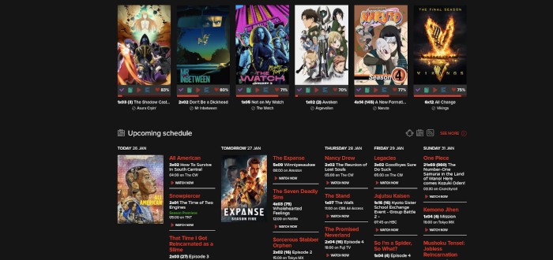
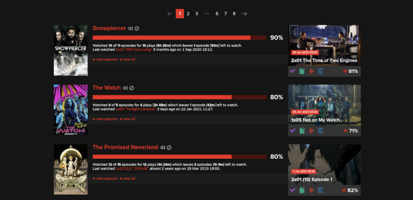

## Dark Mode
Just free dark theme for trakt.tv. Maybe worse than original dark knight theme, but free:)
#### Screenshots:
   
   

## Installation
1. Install any UserScript manager (Recommended: ViolentMonkey):
[Chrome](https://chrome.google.com/webstore/detail/violentmonkey/jinjaccalgkegednnccohejagnlnfdag), [Firefox](https://addons.mozilla.org/en-US/firefox/addon/violentmonkey/?utm_source=addons.mozilla.org&utm_medium=referral&utm_content=search)
2. Select script from the repository, click on "Raw button" and confirm installation. Or use this link:   
   [Dark Mode](https://github.com/sergeyhist/Trakt.tv-Hist-UserScripts/raw/main/scripts/dark-trakt.user.js)  
   